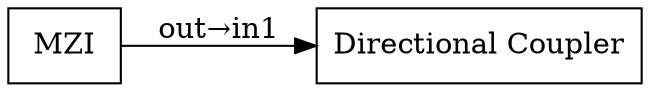

# 系统智能体行为清单（Agents Behavior Inventory）

> **目标**：完整追踪 OPTI-AI/PhIDO 中所有 LLM 驱动的行为、工具调用、后处理流程  
> **更新时间**：2026-03-24  
> **维护者**：系统架构组

---

## 📋 目录

1. [核心工作流（4步 LLM 流水线）](#一核心工作流4步llm流水线)
2. [LLM 路由层（统一调度器）](#二llm-路由层统一调度器)
3. [结构化输出智能体（Pydantic 约束）](#三结构化输出智能体pydantic-约束)
4. [电路后处理工具](#四电路后处理工具工具型行为)
5. [存储与缓存机制](#五存储与缓存机制)
6. [异常处理与降级策略](#六异常处理与降级策略)

---

## 一、核心工作流（4步 LLM 流水线）

### 概览

下表展示从**用户自然语言输入** → **最终 GDS 版图**的完整闭环。其中前 4 步使用 LLM，第 5 步为工具调用。

| 阶段 | 步骤名称 | 入口函数 | 核心 LLM 调用 | 输出格式 | 作用 |
|------|---------|---------|-----------|---------|------|
| I | **EE 实体提取** | `webapp.py:176` | `llm_api.py:1733`<br/>+`llm_api.py:1837` | JSON/YAML 结构体 | 意图分类 + 从自然语言提取光子器件实体、工艺参数 |
| II | **CS 组件选型** | `webapp.py:261` | `llm_api.py:1520`<br/>+`llm_api.py:1465` | 候选组件列表 + 匹配度评分 | 从 PDK 库（磨练库+自动生成库）中检索最匹配的组件 |
| III | **DSL 电路描述生成** | `webapp.py:328` | `llm_api.py:1934`<br/>+`llm_api.py:2023` | YAML DSL 格式 + 节点参数 | 生成 YAML 电路 DSL，注入组件参数 |
| IV | **SG 原理图生成** | `webapp.py:498` | `llm_api.py:1582`<br/>+`llm_api.py:1694` | DOT 图形脚本 | LLM 连接拓扑 + DOT 正确性验证 |
| V | **工具调用：GDS 生成 + 仿真** | `webapp.py:665` | 无 LLM | `.gds`/`.meep`/`.tidy3d` | 调用 gdsfactory 与 Meep/Tidy3D 仿真工具 |

---

### 详细描述

#### I. 实体提取（EE - Entity Extraction）

**入口**：[webapp.py](webapp.py#L176)

```python
def run_entity_extraction_step():
    # 步骤位置编号: webapp.py line 176
```

**LLM 调用链**：

| 序号 | 函数位置 | 函数名 | 目的 | 输出约束 |
|------|---------|--------|------|---------|
| 1 | [llm_api.py:1733](PhotonicsAI/Photon/llm_api.py#L1733) | `intent_classification()` | 对用户输入分类（标准/非标准/混合） | Pydantic: `PromptClass` |
| 2 | [llm_api.py:1837](PhotonicsAI/Photon/llm_api.py#L1837) | `extract_entities_from_text()` | 从文本提取实体清单（器件、工艺、端口） | Pydantic: `InputEntities` |

**Pydantic 约束**:
- **PromptClass**: `{category_id: int, response: str}`  
  - 分类码：1=标准器件, 2=新器件, 3=混合
- **InputEntities**: `{devices: [Device], processes: [Process], ports: [Port]}`  
  - 结构化可靠性：LLM 生成 JSON 后被验证为正确 Python 对象

**质量指标**：
- 实体提取准确率（与人工标注的 F1 分数）
- 字段完整性（关键参数 > 90% 覆盖率）

---

#### II. 组件选型（CS - Component Selection）

**入口**：[webapp.py](webapp.py#L261)

**LLM 调用链**：

| 序号 | 函数位置 | 函数名 | 目的 | 输出约束 |
|------|---------|--------|------|---------|
| 1 | [llm_api.py:1465](PhotonicsAI/Photon/llm_api.py#L1465) | `search_component_library()` | 根据需求检索 PDK 库/自动生成库中最匹配的组件 | Python dict or list |
| 2 | [llm_api.py:1520](PhotonicsAI/Photon/llm_api.py#L1520) | `rank_candidates()` | 为候选组件排序，返回 Top-K | JSON array with scores |

**候选来源**：
1. **磨练库**（PDK）：`PhotonicsAI/Photon/DemoPDK.py` 中的预定义组件类
2. **自动生成缓存**：如 `auto_mmi1x2_consensus.py`、`auto_y_branch_consensus.py`
3. **外部来源**（若未知元件）：从论文、设计库动态生成

**质量指标**：
- Top-1 命中率（预期需求与推荐匹配）
- 候选覆盖率（至少 3 个备选方案）

---

#### III. DSL 电路描述生成（DSL - Digital Signal Logging）

**入口**：[webapp.py](webapp.py#L328)

**LLM 调用链**：

| 序号 | 函数位置 | 函数名 | 目的 | 输出约束 |
|------|---------|--------|------|---------|
| 1 | [llm_api.py:1934](PhotonicsAI/Photon/llm_api.py#L1934) | `generate_dsl()` | 根据选中组件生成 YAML DSL | YAML 格式字符串 |
| 2 | [llm_api.py:2023](PhotonicsAI/Photon/llm_api.py#L2023) | `inject_parameters()` | 将用户/自动参数注入 DSL 节点 | 更新后的 YAML |

**DSL 格式示例**：
```yaml
version: "1.0"
name: "MZI heater circuit"
components:
  - id: "mzi_0"
    type: "mzi"
    params:
      length: 100
      width: 0.5
      heater: true
  - id: "coupler_0"
    type: "directional_coupler"
    params:
      gap: 0.2
connections:
  - from: "mzi_0.out"
    to: "coupler_0.in1"
```

**质量指标**：
- DSL 可解析性（YAML 有效且无格式错误）
- 拓扑完整性（所有端口均有连接或标记为悬空）

---

#### IV. 原理图生成（SG - Schematic Generation）

**入口**：[webapp.py](webapp.py#L498)

**LLM 调用链**：

| 序号 | 函数位置 | 函数名 | 目的 | 输出约束 |
|------|---------|--------|------|---------|
| 1 | [llm_api.py:1582](PhotonicsAI/Photon/llm_api.py#L1582) | `generate_schematic_dsl()` | 根据 DSL 生成 DOT 图形脚本 | DOT 格式字符串 |
| 2 | [llm_api.py:1694](PhotonicsAI/Photon/llm_api.py#L1694) | `validate_dot_syntax()` | 验证 DOT 语法正确性 | 布尔值 + 错误反馈 |

**DOT 输出示例**：


**验证内容**：
- 节点数与 DSL 组件数一致
- 边连接逻辑正确（无循环短路，除非显式允许）
- 所有命名引用有效

**质量指标**：
- DOT 解析成功率 ≥ 95%
- 拓扑逻辑正确率（与 DSL 一致性）

---

#### V. GDS 生成与仿真（工具调用）

**入口**：[webapp.py](webapp.py#L665)

**工具链**：

| 序号 | 函数位置 | 工具 | 目的 | 输出 |
|------|---------|------|------|------|
| 1 | [DemoPDK.py:122](PhotonicsAI/Photon/DemoPDK.py#L122) | `netlist_to_gds()` | 从 YAML DSL → GDS 版图 | `.gds` 文件 |
| 2 | [tidy3d_runner.py 或 meep_runner.py](PhotonicsAI/Photon/) | 仿真后端 | 电磁仿真 | `.meep` / `.tidy3d` 结果 |

---

## 二、LLM 路由层（统一调度器）

### 统一入口

**函数**：[llm_api.py:1416](PhotonicsAI/Photon/llm_api.py#L1416)

```python
def call_llm(prompt, model_type="auto", **kwargs):
    """
    统一路由器，根据 llm_api_selection 参数分发至具体后端
    """
```

### 支持的后端与模型

下表列出所有配置的 LLM 后端及其对应函数。

| 后端 | 对应函数 | 模型列表 | 适用场景 | 状态 |
|------|---------|---------|---------|------|
| **Claude** | [llm_api.py:114](PhotonicsAI/Photon/llm_api.py#L114) | claude-3.5-sonnet<br/>claude-3-opus | 复杂推理、多步骤任务 | ✅ 稳定 |
| **Gemini** | [llm_api.py:271](PhotonicsAI/Photon/llm_api.py#L271) | gemini-1.5-pro<br/>gemini-2.0-flash | 长上下文、快速推理 | ✅ 稳定 |
| **NVIDIA Nemotron** | [llm_api.py:487](PhotonicsAI/Photon/llm_api.py#L487) | nemotron-4-340b | 工程领域特定 | ⚠️ 实验 |
| **智谱 GLM-4** | [llm_api.py:547](PhotonicsAI/Photon/llm_api.py#L547) | glm-4<br/>glm-4-vision | 国内 API，参数精准提取 | ✅ 常用 |
| **阿里云 GLM-5** | [llm_api.py:650](PhotonicsAI/Photon/llm_api.py#L650) | glm-5<br/>qwen-turbo | 阿里 DashScope 后端 | ✅ 常用 |
| **DeepSeek** | [llm_api.py:1319](PhotonicsAI/Photon/llm_api.py#L1319) | deepseek-chat<br/>deepseek-coder | 代码生成、参数提取 | ⚠️ 测试中 |
| **o1/o3** | [llm_api.py:768](PhotonicsAI/Photon/llm_api.py#L768) | o1-preview<br/>o3-mini | 深度推理（高耗时） | ⚠️ 备用 |

### 路由规则

```python
# webapp.py 或配置文件中
llm_api_selection = {
    "entity_extraction": "zhipu",        # 智谱：参数精准
    "component_selection": "claude",     # Claude：复杂逻辑
    "dsl_generation": "gemini",          # Gemini：长输出稳定
    "schematic_generation": "deepseek",  # DeepSeek：代码生成能力
    "fallback": "claude"                 # 备用后端
}
```

### 调用示例

```python
# 通用调用
result = call_llm(
    prompt="Extract entities from: ...",
    model_type="zhipu",
    temperature=0.7,
    max_tokens=2000
)
```

---

## 三、结构化输出智能体（Pydantic 约束）

### 核心概念

这些函数使用 **Pydantic 模型**作为约束，确保 LLM 输出严格符合预定义结构。调用方法为 `callgpt_pydantic(prompt, model_class, llm_backend)`。

### 结构化输出函数清单

#### 1. PromptClass（意图分类）

**位置**：[llm_api.py:1733](PhotonicsAI/Photon/llm_api.py#L1733)

**Pydantic 模型定义**：
```python
class PromptClass(BaseModel):
    category_id: int  # 1=标准, 2=新器件, 3=混合
    response: str     # LLM 理由说明
```

**使用场景**：用户输入分类

**示例输出**：
```json
{
  "category_id": 1,
  "response": "用户要求的是标准 MZI 调制器"
}
```

---

#### 2. InputClarity（输入清晰度判定）

**位置**：[llm_api.py:1791](PhotonicsAI/Photon/llm_api.py#L1791)

**Pydantic 模型**：
```python
class InputClarity(BaseModel):
    is_clear: bool           # 输入是否清晰
    confidence: float        # 0.0~1.0
    missing_fields: List[str]  # 缺失的关键字段
```

**使用场景**：判断用户输入是否包含充足信息

**示例输出**：
```json
{
  "is_clear": false,
  "confidence": 0.65,
  "missing_fields": ["工艺工艺", "端口风扣"]
}
```

---

#### 3. InputEntities（实体提取）

**位置**：[llm_api.py:1837](PhotonicsAI/Photon/llm_api.py#L1837)

**Pydantic 模型**：
```python
class InputEntities(BaseModel):
    devices: List[Device]       # 器件列表
    parameters: Dict[str, Any]  # 参数映射
    ports: List[Port]           # 端口要求
    metadata: Dict[str, Any]    # 额外元数据
```

**使用场景**：从自然语言提取结构化设备/参数信息

**示例输出**：
```json
{
  "devices": [
    {"type": "mzi", "count": 1},
    {"type": "directional_coupler", "count": 2}
  ],
  "parameters": {
    "wavelength": "1550nm",
    "power": "100mW"
  },
  "ports": [
    {"id": "in1", "type": "input"},
    {"id": "out1", "type": "output"}
  ]
}
```

---

#### 4. PaperEntities1（论文参数提取）

**位置**：[llm_api.py:1903](PhotonicsAI/Photon/llm_api.py#L1903)

**Pydantic 模型**：
```python
class PaperEntities1(BaseModel):
    device_type: str
    key_parameters: Dict[str, Any]
    performance_metrics: Dict[str, Any]
    extraction_confidence: float
```

**使用场景**：从学术论文中提取设备参数（自动 PDK 生成工作流）

**示例输出**：
```json
{
  "device_type": "Y-branch splitter",
  "key_parameters": {
    "length": 100,
    "width": 0.5,
    "arm_angle": 15
  },
  "performance_metrics": {
    "splitting_ratio": 0.48,
    "insertion_loss": 0.3,
    "wavelength_range": "1500-1600nm"
  },
  "extraction_confidence": 0.92
}
```

---

#### 5. 通用字典解析（parse_user_specs）

**位置**：[llm_api.py:1956](PhotonicsAI/Photon/llm_api.py#L1956)

**特点**：使用**更宽松的 Pydantic 验证**或**正则表达式匹配**，而非严格的 `BaseModel`

**使用场景**：解析用户自由文本规范，容错能力强

**返回值**：`Dict[str, Any]`（较少验证）

---

### 通用调用接口

```python
def callgpt_pydantic(
    prompt: str,
    model_class: Type[BaseModel],
    llm_backend: str = "claude",
    temperature: float = 0.7,
    max_retries: int = 3
) -> BaseModel:
    """
    调用 LLM 并强制输出解析为 Pydantic 模型
    失败时自动重试
    """
```

---

## 四、电路后处理工具（工具型行为）

### 概览

以下工具**不涉及 LLM 调用**，纯粹是**确定性的算法**或**库函数调用**。

| 函数位置 | 函数名 | 输入 | 输出 | 作用 |
|---------|--------|------|------|------|
| [DemoPDK.py:122](PhotonicsAI/Photon/DemoPDK.py#L122) | `netlist_to_gds()` | YAML DSL | `.gds` 文件 | 网表 → 版图编译 |
| [DemoPDK.py:270](PhotonicsAI/Photon/DemoPDK.py#L270) | `fill_port_info()` | DSL + 组件库 | 更新后的 DSL | 端口信息填充 |
| [DemoPDK.py:242](PhotonicsAI/Photon/DemoPDK.py#L242) | `apply_component_params()` | 参数表 + 组件 | 参数化后的组件 | 组件参数应用 |
| [DemoPDK.py:334](PhotonicsAI/Photon/DemoPDK.py#L334) | `optimize_circuit()` | 拓扑图 + 目标 | 优化后拓扑 | 电路优化（可选） |

### 详细说明

#### 1. 网表→GDS（netlist_to_gds）

**位置**：[DemoPDK.py](PhotonicsAI/Photon/DemoPDK.py#L122)

**输入**：
```yaml
# YAML DSL
name: "mzi_circuit"
components:
  - id: "mzi_0"
    type: "mzi"
    params: {length: 100}
connections:
  - {from: "mzi_0.out", to: "coupler_0.in"}
```

**处理流程**：
1. 解析 YAML → Python 对象
2. 根据 `type` 查找组件模板（gdsfactory）
3. 将参数代入组件生成函数
4. 汇总所有 cell，调用 gdsfactory 编译为 GDS

**输出**：
```
build/output_0.gds  (二进制 GDS 文件)
```

**可能的失败模式**：
- 组件类型未知 → 错误：`Component 'unknown_type' not found`
- 参数不合法 → gdsfactory 内部错误
- 拓扑断连 → 生成但可能包含悬空节点

---

#### 2. 端口信息填充（fill_port_info）

**位置**：[DemoPDK.py](PhotonicsAI/Photon/DemoPDK.py#L270)

**输入**：
```python
dsl = {...}  # 可能缺少具体端口说明的 DSL
component_lib = {...}  # 组件库（可能是 gdsfactory 或本地缓存）
```

**处理流程**：
1. 遍历 DSL 中的每个连接
2. 查符合组件库找连接端点的实际端口名
3. 如果端口名不一致，尝试自动映射（如 `out` → `o`）
4. 填充缺失的端口信息（端口方向、类型）

**输出**：更新后的 DSL，所有连接端口均已确认存在

---

#### 3. 组件参数应用（apply_component_params）

**位置**：[DemoPDK.py](PhotonicsAI/Photon/DemoPDK.py#L242)

**输入**：
```python
params = {"length": 100, "width": 0.5}  # 用户/LLM 生成的参数
component = gdsfactory.Component("mzi")  # 组件对象
```

**处理流程**：
1. 查看组件是否支持这些参数名
2. 验证参数值是否在合法范围内
3. 调用组件的参数化函数
4. 返回参数化后的组件

**输出**：参数化后的 gdsfactory Component 对象

**验证**：
- 参数类型匹配（int, float, bool）
- 参数范围检查

---

#### 4. 电路优化（optimize_circuit）

**位置**：[DemoPDK.py](PhotonicsAI/Photon/DemoPDK.py#L334)

**目的**：可选的电路优化（压缩、重排）

**输入**：
```python
topo_graph = {...}  # 拓扑图（节点+边）
objectives = {      # 优化目标
    "min_area": 0.5,
    "min_crossing": 1.0
}
```

**处理流程**：
1. 分析拓扑的关键指标（面积、交叉数、功耗等）
2. 根据目标应用启发式或算法优化
3. 返回优化后的拓扑

**输出**：优化后的拓扑图

**常见优化**：
- 减少连线交叉
- 紧凑布局
- 平衡负载

---

## 五、存储与缓存机制

### 5.1 组件缓存

**位置**：`PhotonicsAI/KnowledgeBase/DesignLibrary/`

**缓存内容**：
- `auto_mmi1x2_consensus.py` — 自动生成的 MMI 1×2 分束器
- `auto_y_branch_consensus.py` — 自动生成的 Y 型分支
- `y_branch.py` — 标准库 Y 分支（磨练库）
- 其他 `auto_*.py` — 历次自动发现的组件

**缓存策略**：
1. 用户首次请求某类组件时，系统先查本地缓存
2. 若缓存存在，则直接使用
3. 若缓存不存在或版本过旧，触发"发现 + 生成"流程
4. 新组件生成后，写入缓存供下次复用

**缓存版本管理**：
```python
# 每个缓存组件顶部写明
# Generated at: 2026-03-20 15:30
# Source: arxiv+optica+consensus
# Confidence: 0.92
```

---

### 5.2 配置与知识库

**位置**：`PhotonicsAI/config/`

**內容**：
- `component_types_extracted.json` — 已识别的组件类型
- `component_types_extracted.yaml` — YAML 格式的类型定义

**示例**：
```json
{
  "mzi": {
    "type": "modulator",
    "default_params": {"length": 100, "width": 0.5},
    "ports": ["in", "out"]
  },
  "y_branch": {
    "type": "splitter",
    "default_params": {"angle": 15},
    "ports": ["in", "out1", "out2"]
  }
}
```

---

## 六、异常处理与降级策略

### 6.1 LLM API 调用失败

**主要失败模式**：

| 失败类型 | 原因 | 处理方案 |
|---------|------|---------|
| **API Key 无效** | 密钥过期/错误 | 切换备用密钥或后端 |
| **请求超时** | 网络慢 | 自动重试（最多 3 次） |
| **速率限制** | 触发配额 | 等待 + 降级（更简单的提示） |
| **模型不可用** | 后端维护 | **自动切换至备用模型** |

**自动降级链**：
```
一级（首选）: claude-3.5-sonnet
    ↓ 失败
二级（备选）: gemini-1.5-pro
    ↓ 失败
三级（轻量）: deepseek-chat
    ↓ 失败
四级（最后手段）: glm-4（本地）
```

---

### 6.2 组件生成失败

**主要失败模式**：

| 失败类型 | 症状 | 恢复方案 |
|---------|------|---------|
| **参数不合法** | GDS 编译报错 | 补正参数 + 重试 |
| **拓扑断连** | 孤立节点 | 手动补连或提示用户 |
| **端口不匹配** | 连接目标不存在 | 自动端口映射或列出候选 |
| **库外器件** | 缓存未命中 | 触发论文搜索 + 自动生成 |

---

### 6.3 仿真失败

**主要失败模式**：

| 工具 | 失败类型 | 处理方案 |
|------|---------|---------|
| **Meep** | 网格设置不当 | 自动调整网格密度 + 重试 |
| **Tidy3D** | 超时 | 降级至 Meep 或显示部分结果 |
| **GDS 打开失败** | KLayout 不可用 | 跳过可视化，保留数据文件 |

---

## 附录 A：快速参考

### 快捷命令

```bash
# 启动应用
streamlit run PhotonicsAI/Photon/webapp.py

# 运行静态检查
ruff check .

# 运行测试
pytest -q

# 运行完整工作流测试
python scripts/test_e2e_component_generation.py
```

### 环境变量

```bash
# 核心 API 密钥
ZHIPU_API_KEY=your_key
OPENAI_API_KEY=your_key
ALIYUN_API_KEY=your_key

# 模型选择
LLM_API_SELECTION=zhipu  # 或 claude, gemini, etc.

# 缓存
CACHE_DIR=./PhotonicsAI/KnowledgeBase/
ENABLE_CACHE=true
```

---

## 附录 B：文件导航

```
PhotonicsAI/
├── Photon/
│   ├── llm_api.py           ← LLM 路由与结构化输出
│   ├── webapp.py            ← 工作流入口与 UI
│   ├── DemoPDK.py           ← 电路后处理工具
│   ├── tidy3d_runner.py     ← Tidy3D 仿真后端
│   ├── meep_runner.py       ← Meep 仿真后端
│   ├── component_detector.py ← 组件类型识别
│   ├── prompts.yaml         ← LLM 提示词库
│   └── utils.py             ← 通用工具函数
├── KnowledgeBase/
│   ├── DesignLibrary/       ← 组件缓存（auto_*.py）
│   └── ...
├── config/
│   ├── component_types_extracted.json
│   └── component_types_extracted.yaml
└── log/
    └── *.log                ← 运行日志
scripts/
├── auto_pdk_generator.py    ← 论文爬虫 + 参数提取 + 自动生成
└── test_*.py                ← 单元/集成测试
```

---

## 修订历史

| 日期 | 版本 | 作者 | 主要变更 |
|------|------|------|---------|
| 2026-03-24 | v1.0 | 系统架构组 | 初版：四大类完整清单、异常处理、快速参考 |

---

**标签**：`#agents` `#inventory` `#llm-pipeline` `#workflows`
